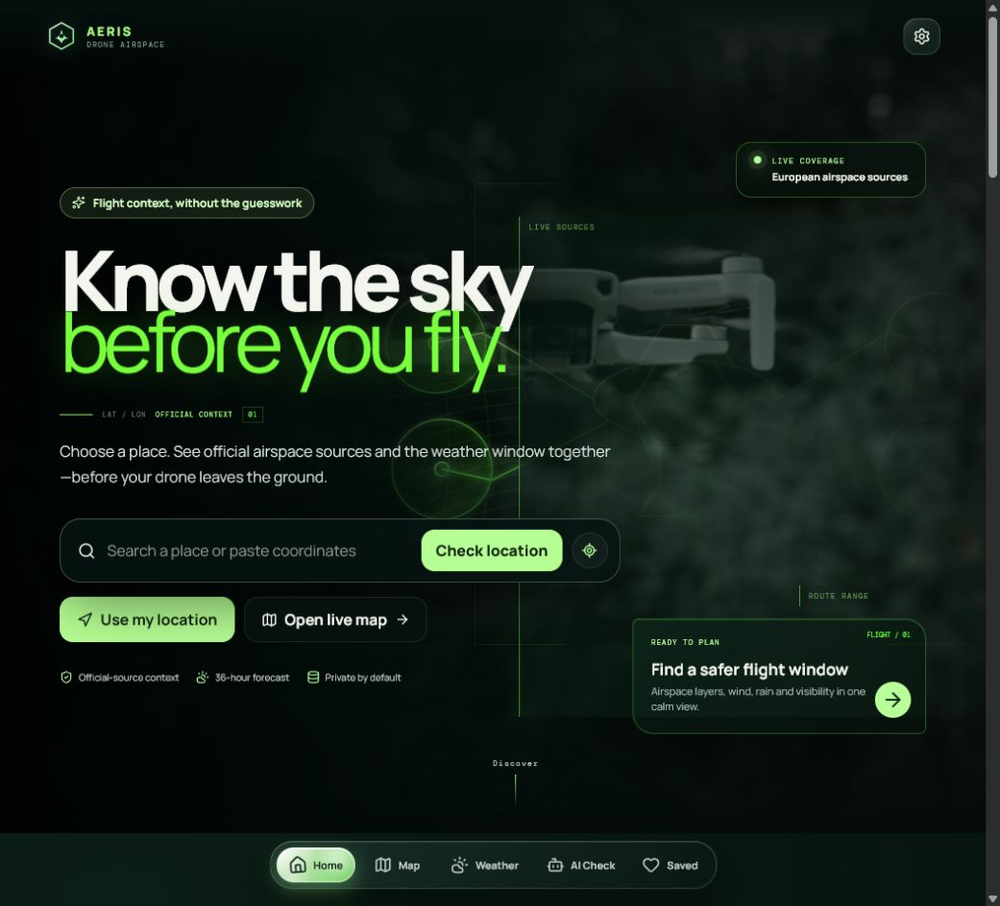

# Aeris · Drone Airspace

[](https://github.com/B1progame/drone-zone-map/actions/workflows/deploy.yml)
[](https://b1progame.github.io/drone-zone-map/)
[](LICENSE)

**Aeris is a privacy-first drone planning workspace for understanding the sky before takeoff.** Search a place, inspect official airspace context, compare weather, plan a route, save it locally, and download Street and/or Satellite map packages for offline use.

> Planning and situational awareness only. Aeris is not an aviation authority and never grants permission to fly. Check the responsible official source before every flight.

## See it first

[](https://b1progame.github.io/drone-zone-map/)



The site is deployed from `main` at [b1progame.github.io/drone-zone-map](https://b1progame.github.io/drone-zone-map/). The UI keeps saved places, routes, preferences, and downloaded packages in the browser by default.

## Why I built it

I built Aeris to make the moment before a flight calmer and more honest: the official source should stay visible, weather should be understandable, and offline planning should remain useful when connectivity is poor. It deliberately separates planning context from legal clearance and records source limitations instead of filling gaps with guesses.

Coverage is still growing. I am actively working on adding every other place and making each country’s official source, attribution, and offline support as reliable as the existing coverage.

## What is included

- MapLibre globe and map views with Street/Satellite display controls
- Official-source coverage and direct authority links across Europe, North America, and additional registry entries
- Search, browser geolocation, weather context, route planning, saved places, and a local flight-context assistant
- Offline packages with independent Street and Satellite selection, automatic large-area splitting, browser storage checks, verification, and download ETA
- Responsive standalone web-app metadata, service-worker shell caching, and Apple Home Screen support
- Current-viewport GeoJSON export and clean map/overlay image capture

## Local-only setup

This project is designed to run locally while developing. No account or API key is required for the basic app.

```powershell
git clone https://github.com/B1progame/drone-zone-map.git
cd drone-zone-map
npm ci
npm run dev
```

Open the local URL printed by Vite. For a production check:

```powershell
npm run build
npm test
```

The offline workflow can request large amounts of storage and network data. Choose a smaller area first, grant browser persistence when prompted, and verify the package before relying on it. Never start a multi-gigabyte download without checking available device storage.

## GitHub Pages deployment

The included workflow builds and publishes `dist` from `main`. In repository settings, select **Pages → GitHub Actions**. The deployment base is `/drone-zone-map/`; local Vite development uses `/`.

## Data and attribution

Aeris does not own the aviation data it displays. Each provider remains subject to its own terms, licence, rate limits, attribution, and freshness. The repository keeps source notes in [`reports/SOURCE_LICENSES.md`](reports/SOURCE_LICENSES.md), the generated registry in [`public/data/sources/countries.json`](public/data/sources/countries.json), and provider-specific documentation in [`docs/`](docs/).

Photography is credited in the app and in [`public/media/CREDITS.md`](public/media/CREDITS.md). Map, satellite, weather, and aviation-source credits remain visible in the app. Missing data is never treated as permission to fly.

## Documentation

The documentation is kept in [`wiki/`](wiki/) so it works immediately from the repository, can be reviewed in pull requests, and can be copied into the native GitHub Wiki after its first page is initialized:

- [`wiki/Home.md`](wiki/Home.md) — project orientation
- [`wiki/Local-setup.md`](wiki/Local-setup.md) — setup and verification from a clean machine
- [`wiki/Why-Aeris.md`](wiki/Why-Aeris.md) — motivation, privacy, and design choices
- [`wiki/Offline-maps.md`](wiki/Offline-maps.md) — Street/Satellite packages and storage behavior
- [`wiki/License-and-attribution.md`](wiki/License-and-attribution.md) — usage boundaries and third-party notices

GitHub’s native Wiki is enabled, but its first page must be created once in the [Wiki editor](https://github.com/B1progame/drone-zone-map/wiki/_new). GitHub only provisions the separate wiki repository after that first save.

## License

Free use is permitted for personal, educational, research, and internal organisational purposes. Redistribution, resale, sublicensing, repackaging, and offering the project as a separate hosted/downloadable product are not permitted without written permission. Read [`LICENSE`](LICENSE) and [`THIRD_PARTY_NOTICES.md`](THIRD_PARTY_NOTICES.md) before using or modifying the repository.

This is a source-available custom licence, not an OSI-approved open-source licence. Third-party datasets and media are not relicensed by it.

## Contact

The project is maintained by [B1progame](https://github.com/B1progame). Issues and improvement ideas belong on the repository’s [Issues](https://github.com/B1progame/drone-zone-map/issues) page.
