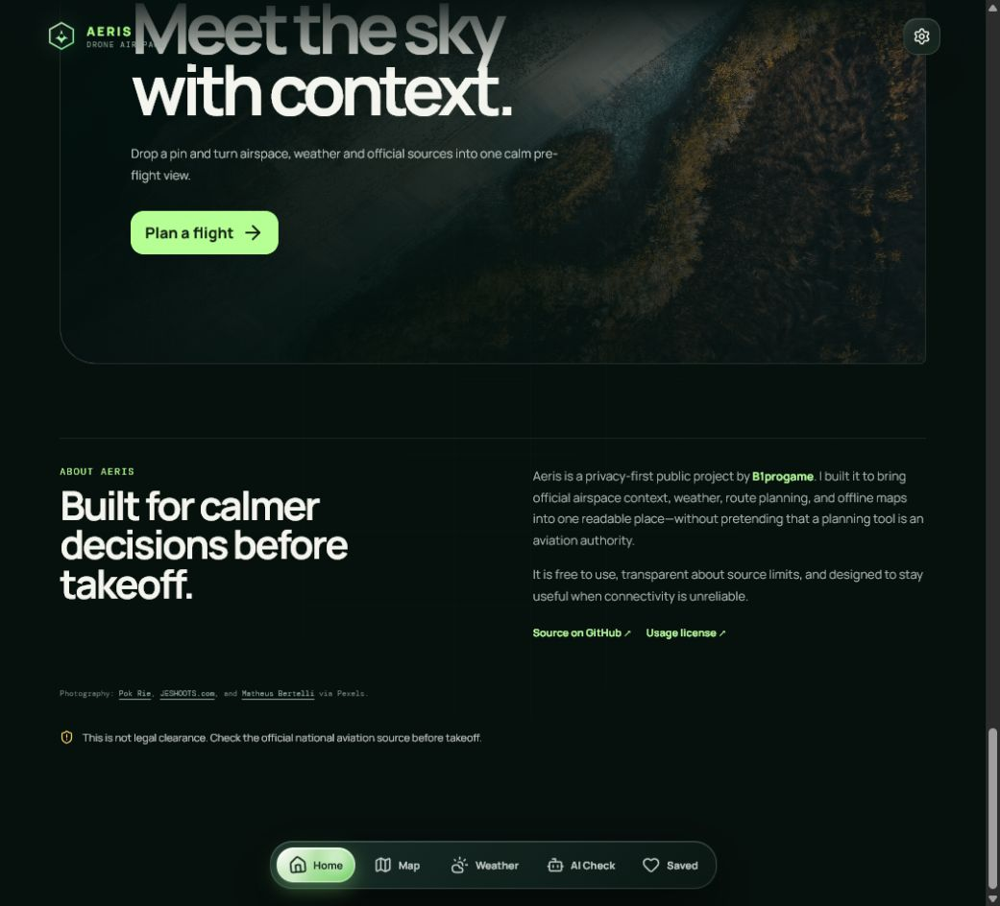

# Local setup



## Requirements

- Node.js with npm
- Python 3.11 or newer for the source-audit pipeline tests
- A modern browser; `localhost` is a secure context for local PWA testing

## Install and run

```powershell
git clone https://github.com/B1progame/drone-zone-map.git
cd drone-zone-map
npm ci
npm run dev
```

Open the Vite URL printed in the terminal. The basic app does not require an account or an API key.

## Verify a change

```powershell
npm run build
npm test
```

Use the in-app map to select a location, open **Airspace sources and downloads**, and inspect a small offline package before attempting a large one. Offline packages use browser storage and can consume substantial disk space.

## Optional data pipeline

The pipeline is intentionally conservative. See [`docs/DEPLOYMENT.md`](../docs/DEPLOYMENT.md), [`docs/DATA_SOURCES.md`](../docs/DATA_SOURCES.md), and [`docs/UPDATING_DATA.md`](../docs/UPDATING_DATA.md) before running data commands. Do not put private exports or credentials in the repository.
