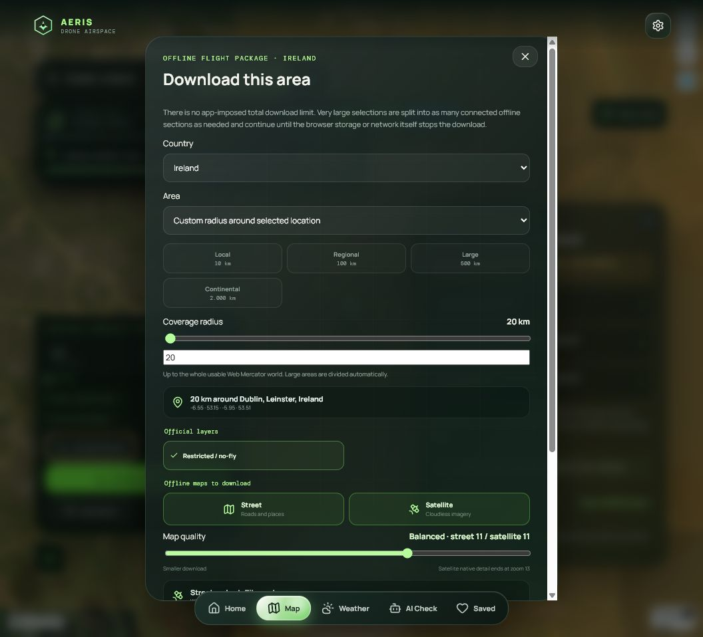

# Offline maps

Open the live map, choose a place, then open **Airspace sources and downloads**. The package builder lets you select:

- Street maps;
- Satellite imagery;
- both layers together.

The selected area is split automatically when it is too large for one browser-safe section. The progress panel reports received items, current stage, and an ETA after enough real download progress has been measured.

Offline packages also contain the selected official layers where reuse is permitted. A package is stored in IndexedDB and checked after saving. Browser quota, device storage, network availability, provider terms, and freshness still apply.

Start with a small local area. Check the browser's available storage before requesting country-scale or high-zoom coverage, and verify the current official source again before flying.
